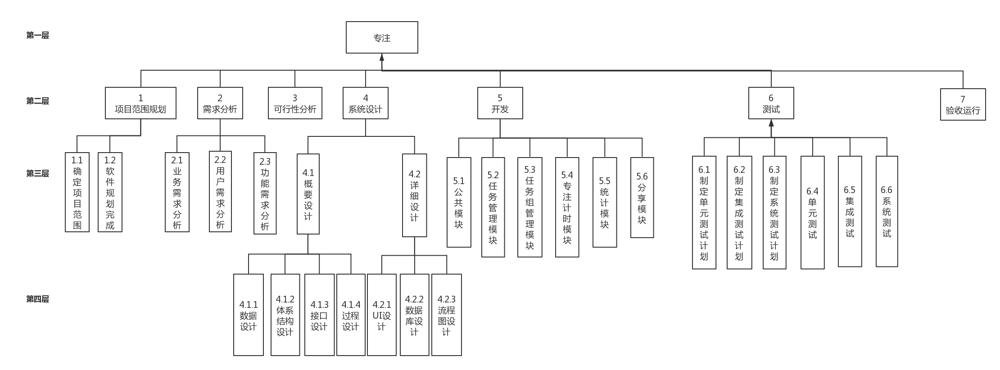
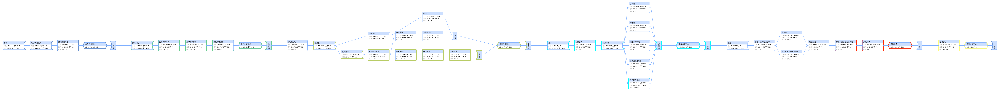
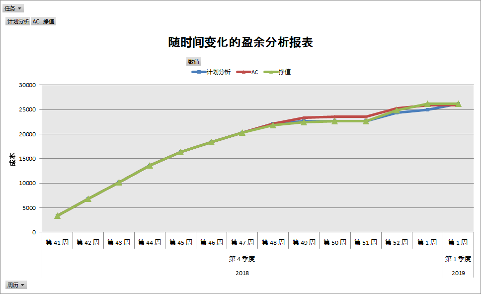
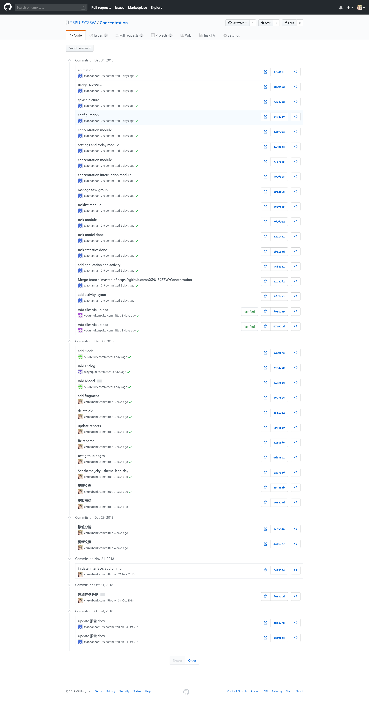

# Concentration

[TOC]

## 1 项目背景

​随着信息技术的发展，网络的普及程度越来越高，越来越多的社交平台，游戏应用在各大移动应用平台上线。中国互联网络信息中心（CNNIC）发布的第41次《中国互联网络发展状况统计报告》显示，截至2017年12月，我国网民规模达7.72亿，人均每周上网时间为27小时。在地铁，公交等各个公共场所，随处可见低头族们，拿出手机浏览着网络上成千上万条信息，与世界各地的人民分享自己的生活。在这快节奏的信息时代，人们变的无法专注，他们常常会被手机上各类应用所弹出的通知，或者是网络上形形色色的信息所吸引，没有一块完整的时间来专注，导致效率极低。同时，人与人之间的差距在于碎片化时间的利用，本软件能更好的帮助用户利用他们的碎片化时间，以及专注于所做的事。

## 2 项目管理目标
项目的管理目标如下表所示：
<table>
    <tr>
        <td>进度目标</td>
        <td>项目开始</td>
        <td>2018年10月8日</td>
    </tr>
    <tr>
        <td></td>
        <td>项目完成</td>
        <td>2019年1月1日</td>
    </tr>
    <tr>
        <td></td>
        <td>项目工期</td>
        <td>85天</td>
    </tr>
    <tr>
        <td>成本目标</td>
        <td>项目预算</td>
        <td>3万元</td>
    </tr>
    <tr>
        <td>质量目标</td>
        <td>项目质量</td>
        <td>达到约定质量标准</td>
    </tr>
</table>

## 3 项目工作分解结构
根据本项目特点对项目进行结构分解，明确项目所包含的所有工作任务，如下图：

## 4 开发总承包单位项目管理组织结构

## 5 项目任务作业清单

在工作分解结构的基础上进行工期目标的制定。并开展工程预算工作，本项目作业清单如下：

| **WBS Number** | **Title**                    | **Time**       | **Total Task Cost** |
| -------------- | ---------------------------- | -------------- | ------------------- |
| **1**          | 专注                         | 3 月 3 天      | ¥26,160.00          |
| **1.1**        | 项目范围规划                 | 4 天           |                     |
| **1.1.1**      | 确定项目范围                 | 4 天           | ¥2,600.00           |
| **1.1.2**      | 软件规划完成                 |                |                     |
| **1.2**        | 需求分析                     | 1 周 1 天      | ¥4,200.00           |
| **1.2.1**      | 业务需求分析                 | 2 天           | ¥1,400.00           |
| **1.2.2**      | 用户需求分析                 | 2 天           | ¥1,400.00           |
| **1.2.3**      | 功能需求分析                 | 2 天           | ¥1,400.00           |
| **1.2.4**      | 需求分析完成                 |                |                     |
| **1.3**        | 可行性分析                   | 2 天           | ¥1,400.00           |
| **1.4**        | 系统设计                     | 2 周           | ¥6,320.00           |
| **1.4.1**      | 概要设计                     | 2 周           | ¥4,400.00           |
| **1.4.1.1**    | 数据字典设计                 | 4 天           | ¥1,640.00           |
| **1.4.1.2**    | 体系结构设计                 | 2 天           | ¥920.00             |
| **1.4.1.3**    | 接口设计                     | 2 天           | ¥920.00             |
| **1.4.1.4**    | 过程设计                     | 2 天           | ¥920.00             |
| **1.4.2**      | 详细设计                     | 1 周 3 天      | ¥1,920.00           |
| **1.4.2.1**    | UI设计                       | 4 天           | ¥960.00             |
| **1.4.2.2**    | 数据库设计                   | 2 天           | ¥480.00             |
| **1.4.2.3**    | 流程图设计                   | 2 天           | ¥480.00             |
| **1.4.3**      | 系统设计完成                 |                |                     |
| **1.5**        | 开发                         | 2 周           | ¥4,080.00           |
| **1.5.1**      | 公共模块                     | 2 天           | ¥1,200.00           |
| **1.5.2**      | 具体模块                     | 1 周 3 天      | ¥2,880.00           |
| **1.5.2.1**    | 任务管理模块                 | 1 周 3 天      | ¥960.00             |
| **1.5.2.2**    | 任务组管理模块               | 4 天           | ¥480.00             |
| **1.5.2.3**    | 专注计时模块                 | 4 天           | ¥480.00             |
| **1.5.2.4**    | 统计模块                     | 4 天           | ¥480.00             |
| **1.5.2.5**    | 分享模块                     | 4 天           | ¥480.00             |
| **1.5.3**      | 系统编码完成                 |                |                     |
| **1.6**        | 测试                         | 1 月 1 周 2 天 | ¥4,960.00           |
| **1.6.1**      | 根据产品规范制定单元测试计划 | 2 天           | ¥920.00             |
| **1.6.2**      | 根据产品规范制定集成测试计划 | 2 天           | ¥680.00             |
| **1.6.3**      | 根据产品规范制定系统测试计划 | 2 天           | ¥480.00             |
| **1.6.4**      | 单元测试                     | 4 天           | ¥1,440.00           |
| **1.6.5**      | 集成测试                     | 4 天           | ¥960.00             |
| **1.6.6**      | 系统测试                     | 2 天           | ¥480.00             |
| **1.6.7**      | 测试完成                     |                |                     |
| **1.7**        | 验收运行                     | 4 天           | ¥2,600.00           |
| **1.8**        | 系统提交完成                 |                |                     |

## 6 项目管理职能分工表
| 名称                         | 开始日期             | 结束日期            | 持续时间 | 分配成本  |
| ---------------------------- | -------------------- | ------------------- | -------- | --------- |
| **宋子涵**                   | 2018/10/8 上午10:00  | 2019/1/2 下午4:00   | 46 天    | ¥5,520.00 |
| 确定项目范围                 | 2018/10/8 上午10:00  | 2018/10/11 下午4:00 | 4 天     | ¥480.00   |
| 业务需求分析                 | 2018/10/12 上午10:00 | 2018/10/15 下午4:00 | 2 天     | ¥240.00   |
| 用户需求分析                 | 2018/10/16 上午10:00 | 2018/10/17 下午4:00 | 2 天     | ¥240.00   |
| 功能需求分析                 | 2018/10/18 上午10:00 | 2018/10/19 下午4:00 | 2 天     | ¥240.00   |
| 可行性分析                   | 2018/10/22 上午10:00 | 2018/10/23 下午4:00 | 2 天     | ¥240.00   |
| 数据字典设计                 | 2018/10/24 上午10:00 | 2018/10/29 下午4:00 | 4 天     | ¥480.00   |
| 体系结构设计                 | 2018/10/30 上午10:00 | 2018/10/31 下午4:00 | 2 天     | ¥240.00   |
| 接口设计                     | 2018/11/1 上午10:00  | 2018/11/2 下午4:00  | 2 天     | ¥240.00   |
| 过程设计                     | 2018/11/5 上午10:00  | 2018/11/6 下午4:00  | 2 天     | ¥240.00   |
| 公共模块                     | 2018/11/7 上午10:00  | 2018/11/8 下午4:00  | 2 天     | ¥240.00   |
| 任务管理模块                 | 2018/11/9 上午10:00  | 2018/11/20 下午4:00 | 8 天     | ¥960.00   |
| 根据产品规范制定单元测试计划 | 2018/11/21 上午10:00 | 2018/11/22 下午4:00 | 2 天     | ¥240.00   |
| 单元测试                     | 2018/11/23 上午10:00 | 2018/11/28 下午4:00 | 4 天     | ¥480.00   |
| 根据产品规范制定系统测试计划 | 2018/12/24 上午10:00 | 2018/12/25 下午4:00 | 2 天     | ¥240.00   |
| 系统测试                     | 2018/12/26 上午10:00 | 2018/12/27 下午4:00 | 2 天     | ¥240.00   |
| 验收运行                     | 2018/12/28 上午10:00 | 2019/1/2 下午4:00   | 4 天     | ¥480.00   |
| **褚旭**                     | 2018/10/8 上午10:00  | 2019/1/2 下午4:00   | 42 天    | ¥5,040.00 |
| 确定项目范围                 | 2018/10/8 上午10:00  | 2018/10/11 下午4:00 | 4 天     | ¥480.00   |
| 业务需求分析                 | 2018/10/12 上午10:00 | 2018/10/15 下午4:00 | 2 天     | ¥240.00   |
| 用户需求分析                 | 2018/10/16 上午10:00 | 2018/10/17 下午4:00 | 2 天     | ¥240.00   |
| 功能需求分析                 | 2018/10/18 上午10:00 | 2018/10/19 下午4:00 | 2 天     | ¥240.00   |
| 可行性分析                   | 2018/10/22 上午10:00 | 2018/10/23 下午4:00 | 2 天     | ¥240.00   |
| 数据字典设计                 | 2018/10/24 上午10:00 | 2018/10/29 下午4:00 | 4 天     | ¥480.00   |
| 体系结构设计                 | 2018/10/30 上午10:00 | 2018/10/31 下午4:00 | 2 天     | ¥240.00   |
| 接口设计                     | 2018/11/1 上午10:00  | 2018/11/2 下午4:00  | 2 天     | ¥240.00   |
| 过程设计                     | 2018/11/5 上午10:00  | 2018/11/6 下午4:00  | 2 天     | ¥240.00   |
| 公共模块                     | 2018/11/7 上午10:00  | 2018/11/8 下午4:00  | 2 天     | ¥240.00   |
| 专注计时模块                 | 2018/11/9 上午10:00  | 2018/11/14 下午4:00 | 4 天     | ¥480.00   |
| 根据产品规范制定单元测试计划 | 2018/11/21 上午10:00 | 2018/11/22 下午4:00 | 2 天     | ¥240.00   |
| 单元测试                     | 2018/11/23 上午10:00 | 2018/11/28 下午4:00 | 4 天     | ¥480.00   |
| 根据产品规范制定系统测试计划 | 2018/12/24 上午10:00 | 2018/12/25 下午4:00 | 2 天     | ¥240.00   |
| 系统测试                     | 2018/12/26 上午10:00 | 2018/12/27 下午4:00 | 2 天     | ¥240.00   |
| 验收运行                     | 2018/12/28 上午10:00 | 2019/1/2 下午4:00   | 4 天     | ¥480.00   |
| **朱佳俊**                   | 2018/10/8 上午10:00  | 2019/1/2 下午4:00   | 38 天    | ¥4,560.00 |
| 确定项目范围                 | 2018/10/8 上午10:00  | 2018/10/11 下午4:00 | 4 天     | ¥480.00   |
| 业务需求分析                 | 2018/10/12 上午10:00 | 2018/10/15 下午4:00 | 2 天     | ¥240.00   |
| 用户需求分析                 | 2018/10/16 上午10:00 | 2018/10/17 下午4:00 | 2 天     | ¥240.00   |
| 功能需求分析                 | 2018/10/18 上午10:00 | 2018/10/19 下午4:00 | 2 天     | ¥240.00   |
| 可行性分析                   | 2018/10/22 上午10:00 | 2018/10/23 下午4:00 | 2 天     | ¥240.00   |
| 数据字典设计                 | 2018/10/24 上午10:00 | 2018/10/29 下午4:00 | 4 天     | ¥480.00   |
| 体系结构设计                 | 2018/10/30 上午10:00 | 2018/10/31 下午4:00 | 2 天     | ¥240.00   |
| 接口设计                     | 2018/11/1 上午10:00  | 2018/11/2 下午4:00  | 2 天     | ¥240.00   |
| 过程设计                     | 2018/11/5 上午10:00  | 2018/11/6 下午4:00  | 2 天     | ¥240.00   |
| 公共模块                     | 2018/11/7 上午10:00  | 2018/11/8 下午4:00  | 2 天     | ¥240.00   |
| 任务组管理模块               | 2018/11/9 上午10:00  | 2018/11/14 下午4:00 | 4 天     | ¥480.00   |
| 根据产品规范制定单元测试计划 | 2018/11/21 上午10:00 | 2018/11/22 下午4:00 | 2 天     | ¥240.00   |
| 单元测试                     | 2018/11/23 上午10:00 | 2018/11/28 下午4:00 | 4 天     | ¥480.00   |
| 验收运行                     | 2018/12/28 上午10:00 | 2019/1/2 下午4:00   | 4 天     | ¥480.00   |
| **吴嘉政**                   | 2018/10/8 上午10:00  | 2019/1/2 下午4:00   | 36 天    | ¥4,320.00 |
| 确定项目范围                 | 2018/10/8 上午10:00  | 2018/10/11 下午4:00 | 4 天     | ¥480.00   |
| 业务需求分析                 | 2018/10/12 上午10:00 | 2018/10/15 下午4:00 | 2 天     | ¥240.00   |
| 用户需求分析                 | 2018/10/16 上午10:00 | 2018/10/17 下午4:00 | 2 天     | ¥240.00   |
| 功能需求分析                 | 2018/10/18 上午10:00 | 2018/10/19 下午4:00 | 2 天     | ¥240.00   |
| 可行性分析                   | 2018/10/22 上午10:00 | 2018/10/23 下午4:00 | 2 天     | ¥240.00   |
| UI设计                       | 2018/10/24 上午10:00 | 2018/10/29 下午4:00 | 4 天     | ¥480.00   |
| 数据库设计                   | 2018/10/30 上午10:00 | 2018/10/31 下午4:00 | 2 天     | ¥240.00   |
| 流程图设计                   | 2018/11/1 上午10:00  | 2018/11/2 下午4:00  | 2 天     | ¥240.00   |
| 公共模块                     | 2018/11/7 上午10:00  | 2018/11/8 下午4:00  | 2 天     | ¥240.00   |
| 统计模块                     | 2018/11/9 上午10:00  | 2018/11/14 下午4:00 | 4 天     | ¥480.00   |
| 根据产品规范制定集成测试计划 | 2018/11/23 上午10:00 | 2018/11/26 下午4:00 | 2 天     | ¥240.00   |
| 集成测试                     | 2018/11/29 上午10:00 | 2018/12/4 下午4:00  | 4 天     | ¥480.00   |
| 验收运行                     | 2018/12/28 上午10:00 | 2019/1/2 下午4:00   | 4 天     | ¥480.00   |
| **施健一**                   | 2018/10/8 上午10:00  | 2019/1/2 下午4:00   | 36 天    | ¥4,320.00 |
| 确定项目范围                 | 2018/10/8 上午10:00  | 2018/10/11 下午4:00 | 4 天     | ¥480.00   |
| 业务需求分析                 | 2018/10/12 上午10:00 | 2018/10/15 下午4:00 | 2 天     | ¥240.00   |
| 用户需求分析                 | 2018/10/16 上午10:00 | 2018/10/17 下午4:00 | 2 天     | ¥240.00   |
| 功能需求分析                 | 2018/10/18 上午10:00 | 2018/10/19 下午4:00 | 2 天     | ¥240.00   |
| 可行性分析                   | 2018/10/22 上午10:00 | 2018/10/23 下午4:00 | 2 天     | ¥240.00   |
| UI设计                       | 2018/10/24 上午10:00 | 2018/10/29 下午4:00 | 4 天     | ¥480.00   |
| 数据库设计                   | 2018/10/30 上午10:00 | 2018/10/31 下午4:00 | 2 天     | ¥240.00   |
| 流程图设计                   | 2018/11/1 上午10:00  | 2018/11/2 下午4:00  | 2 天     | ¥240.00   |
| 公共模块                     | 2018/11/7 上午10:00  | 2018/11/8 下午4:00  | 2 天     | ¥240.00   |
| 分享模块                     | 2018/11/9 上午10:00  | 2018/11/14 下午4:00 | 4 天     | ¥480.00   |
| 根据产品规范制定集成测试计划 | 2018/11/23 上午10:00 | 2018/11/26 下午4:00 | 2 天     | ¥240.00   |
| 集成测试                     | 2018/11/29 上午10:00 | 2018/12/4 下午4:00  | 4 天     | ¥480.00   |
| 验收运行                     | 2018/12/28 上午10:00 | 2019/1/2 下午4:00   | 4 天     | ¥480.00   |

## 7.1 甘特图

## 7.2 网络图

## 8 项目资源计划安排

| 资源名称 | 类型 | 材料标签 | 缩写 | 组  | 最大单位 | 标准费率    | 加班费率   | 每次使用成本 | 成本累算 | 基准日历 |
| -------- | ---- | -------- | ---- | --- | -------- | ----------- | ---------- | ------------ | -------- | -------- |
| 宋子涵   | 工时 |          | 宋   |     | 100%     | ¥30.00/工时 | ¥0.00/工时 | ¥0.00        | 按比例   | 标准     |
| 褚旭     | 工时 |          | 褚   |     | 100%     | ¥30.00/工时 | ¥0.00/工时 | ¥0.00        | 按比例   | 标准     |
| 朱佳俊   | 工时 |          | 朱   |     | 100%     | ¥30.00/工时 | ¥0.00/工时 | ¥0.00        | 按比例   | 标准     |
| 吴嘉政   | 工时 |          | 吴   |     | 100%     | ¥30.00/工时 | ¥0.00/工时 | ¥0.00        | 按比例   | 标准     |
| 施健一   | 工时 |          | 施   |     | 100%     | ¥30.00/工时 | ¥0.00/工时 | ¥0.00        | 按比例   | 标准     |
| 会议室   | 材料 |          | 会   |     |          | ¥0.00       |            | ¥300.00      | 按比例   |          |

## 9 项目进度控制
2018 年 12 月 25 日，项目组长对项目各项工作进度进行检查，检查结果如下表。

## 10 项目赢得值分析

## 11 Git配置管理

组员权限：

提交记录：

